# The TcCOM Module

The Gamepad TcCOM module is a TwinCAT C++ module that reads a controller from the service and exposes it as linkable process data, with no PLC code involved. You add an instance to a TwinCAT project, assign it to a task, set the controller number, and link the outputs like any other process data. It polls the service once per task cycle and zeroes all outputs when the service stops answering.

The engineering workload installs the module compiled and signed into the TwinCAT module repository, so it is ready to add right after the install. Builds are included for TwinCAT RT x86, TwinCAT RT x64, TwinCAT OS x64 and Beckhoff RT Linux x64, where the build result is a TME file the target loads without signing. The source lives in the project repository on GitHub for anyone who prefers to build and sign the module themselves; the last section covers that path.

## Adding an instance

Right click TcCOM Objects under System in the solution tree and choose Add New Item, then pick ADS_Gamepad from the Beckhoff Community vendor:

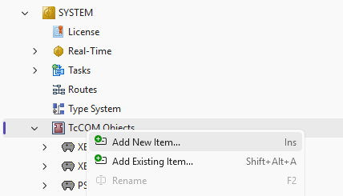

One instance serves one controller. Add an instance per controller slot you want to read, and give each a name that says which pad it is:

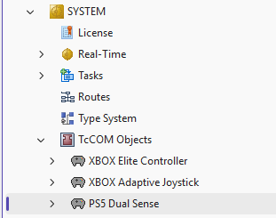

## Assigning a task

The module needs a cyclic task to run in. If the project has none, right click Tasks and add one:

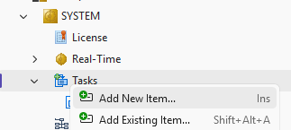

A plain TwinCAT Task without an image is all the module needs:

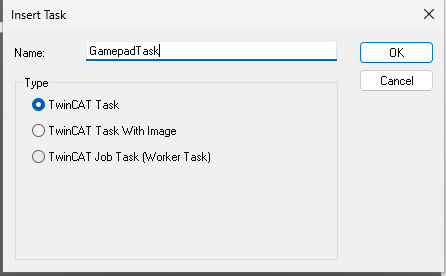

Then select the task in the Context tab of the module instance:

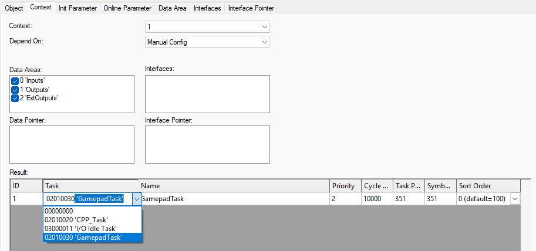

After assigning the task, check the Interface Pointer tab once: CyclicCaller must hold the object id of that task. XAE normally fills this in when you set the context, and the module refuses to reach OP while it is 0, on purpose, so a half wired instance fails loudly instead of idling.

## Parameters

The Parameter (Init) tab holds the settings that are stored in the project:

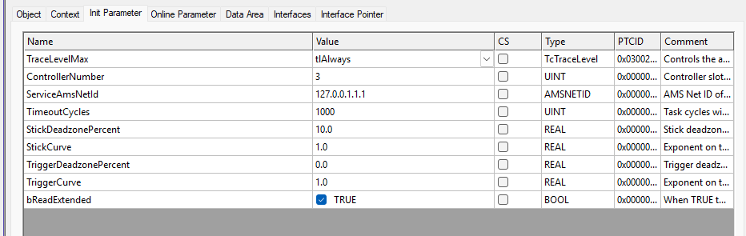

| Name | Default | Meaning |
| --- | --- | --- |
| ControllerNumber | 1 | Controller slot on the service, 1 to 4. One instance serves one controller. |
| ServiceAmsNetId | 127.0.0.1.1.1 | AMS Net ID of the machine running the service. The default resolves the local system automatically, so on a single machine setup you change nothing. For a remote service, enter its Net ID; the service page covers routes. |
| TimeoutCycles | 1000 | Task cycles without an ADS answer before the outputs are zeroed and the read is retried. |
| bReadExtended | FALSE | When TRUE the module also reads the extended data block with the PlayStation extras and the battery detail. Needs service 2.5.0 or newer. The reads alternate with the controller read, so each block then updates at half the task rate. |
| Stick and trigger tuning | | Deadzone percent and response curve per stick and trigger, stored in the project. |

The tuning values come in two sets. The init set is stored in the project, and at startup the module copies it into an online twin set on the Parameter (Online) tab. During commissioning you adjust the online values and feel the result on the next task cycle, no restart needed; when a value feels right, copy it into its init twin to make it permanent:

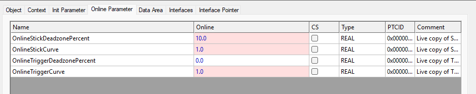

## Process data

The standard outputs are decoded and ready to link: the connected state, one BOOL per button, shaped stick and trigger values, the raw wire words for power users, communication diagnostics including a data age counter, and the service version information from the handshake:

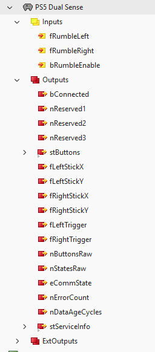

With bReadExtended set, a second output area carries the extended data: the PS, Mute and touchpad click buttons, both touchpad contacts, the raw motion sensors, the report counter, the battery percent and charging state, and a separate data age counter for the extended read:

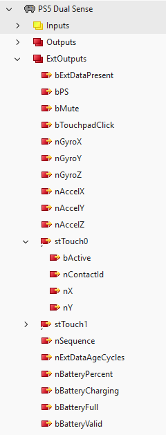

The report counter nSequence makes a good watchdog: a value that keeps moving proves the input stream is alive. An error on the extended read zeroes only the extended values; the controller exchange keeps running untouched.

## Updating the module

When a new module version is installed, reload it in an existing project by right clicking the instance and choosing Reload:

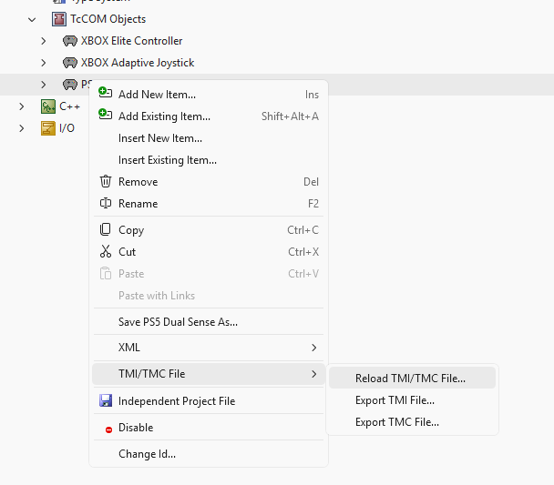

The version can also be changed explicitly in the TcCOM Objects list:

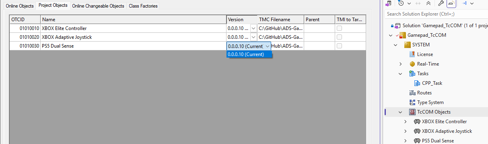

What each module version needs and adds:

| Module version | Needs service | Adds |
| --- | --- | --- |
| 0.0.0.7 | 2.1.0 | Controller data, rumble, tuning parameters, version handshake |
| 0.0.0.9 | 2.5.0 for the extended data | The extended output area behind bReadExtended |
| 0.0.0.10 | 2.6.0 for the battery fields | Battery percent and charging state in the extended outputs |
| 0.0.0.11 | Same as 0.0.0.10 | The Beckhoff RT Linux build, a TME file the target loads without signing; no functional change |

Any module version works against any 2.x service for the controller data itself; the handshake in stServiceInfo tells you what the service serves.

## Building from source

The module source lives under tccom in the project repository, for anyone who wants to audit it, extend it, or build for a platform the packages do not cover. TwinCAT loads a C++ module on Windows only when it is signed with a certificate the target trusts, so a self built module must be signed with your own TwinCAT user certificate, either an official Beckhoff OEM certificate or a test signing certificate together with test mode on the target. The readme in the tccom directory covers the requirements, the build steps and the signing options.
