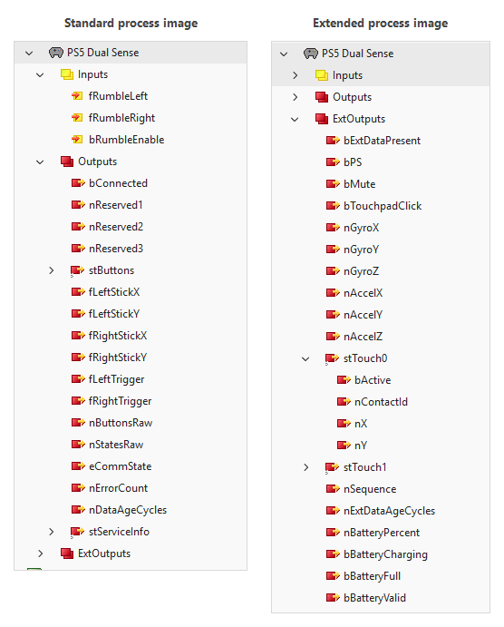

# ADS Gamepad Service

ADS Gamepad Service connects PlayStation and Xbox gamepads attached to PCs, IPCs, and CX devices, then hosts the input data over ADS for the PLC to access. It runs as a system service on TwinCAT Windows systems and on Beckhoff RT Linux, and includes a PLC library and a TcCOM module for reading gamepad data in your project. The PlayStation 5 DualSense is the recommended controller: it connects over USB or Bluetooth, reports a real battery percentage, and serves extra data such as the touchpad and motion sensors. The full documentation lives under [Documentation in this repository.](https://beckhoff-usa-community.github.io/ADS-Gamepad-Service/)

The TcCOM module turns a controller into linkable process data with no PLC code involved, from the classic buttons and sticks to the touchpad, motion sensors and battery of a DualSense:



## Installing on Windows

The project ships as TwinCAT packages on the GitHub package feed of the Beckhoff USA Community organization. Four steps: create a token, add the feed, install the workload that matches the system, set the controller type.

**1. Create a token.** GitHub requires a login for its package feeds, even for public packages. In your GitHub account under Developer settings, create a personal access token of the classic type with the read:packages scope. The token starts with ghp_.

**2. Add the feed** from an administrator PowerShell, and enter the token when prompted for a password:

```powershell
tcpkg config unset -n VerifySignatures
tcpkg source add -n "Beckhoff-USA-Community" -s https://nuget.pkg.github.com/Beckhoff-USA-Community/index.json -u <your GitHub user name> --take 100
```

Both settings are required, not optional, and the order matters:

* `tcpkg config unset -n VerifySignatures` allows packages that are not signed by Beckhoff. Community packages carry no Beckhoff signature, including the disclaimer package the feed presents while it is being added, so verification must be off before the feed is added.
* `--take 100` limits search requests to 100 results per page. GitHub rejects anything larger, while the TwinCAT Package Manager asks for 500 by default. Without this option, adding the feed fails with the error "Failed to retrieve metadata from source".

Adding the feed shows the community disclaimer; accept it to continue.

**3. Install.** The runtime workload puts the service on the system that has the controllers attached. The engineering workload puts the PLC library, the compiled TcCOM module and the documentation on the system that runs XAE. Run the line that matches the system, or both on a machine that does both jobs:

```powershell
tcpkg install Beckhoff-USA-Community.AdsGamepad.XAR -y
tcpkg install Beckhoff-USA-Community.AdsGamepad.XAE -y
```

After the install the service is running, the AdsGamepad library is in the XAE library repository ready to reference, and the Gamepad TcCOM module is in the TwinCAT module repository ready to add to a project.

**4. Set the controller type.** The service ships configured for one PlayStation DualSense controller, so a DualSense on a USB cable works right away. To read Xbox controllers instead, set the slots to XInput in C:\Program Files\Beckhoff USA Community\ADS Gamepad\Service\appsettings.json and restart the service with Restart-Service AdsGamepadService. The service page of the documentation covers every setting.

If adding the feed fails, confirm the token is the classic type (it starts with ghp_), that it has the read:packages scope, and that it has not expired.

## Installing on Beckhoff RT Linux

The service ships as a Debian package, attached to each release on the Releases page of this repository. Releases from 2.12.0 on attach two packages: amd64 for the x86 controllers and arm64 for the ARM controllers such as the CX8200 and CX9240 series. Download the one matching your target, copy it over, and install it with apt:

```
sudo apt-get install wget -y

wget https://github.com/Beckhoff-USA-Community/ADS-Gamepad-Service/releases/download/<vX.X.X>/ads-gamepad-service_<X.X.X>_<arch>.deb
```

```
sudo apt install ./ads-gamepad-service_*.deb
```
The package creates a service account, sets up device access for the DualSense, and starts the systemd unit. The default configuration reads one DualSense on slot one, so the pad works with no edit. On the ARM controllers the standard kernel currently needs one rebuilt module before the pad can be read; the Linux installation page of the documentation has the steps. Settings live in /opt/ads-gamepad-service/appsettings.json and survive upgrades. The linux directory and the Linux installation page of the documentation cover the details, including the build from source path.

## Updating

New releases appear on the same feed. Upgrade a workload from an administrator PowerShell and its component packages follow, since every workload pins its components at exact versions. The service keeps an edited appsettings.json across upgrades, even when the upgrade moves the installation to a new location.

```powershell
tcpkg upgrade Beckhoff-USA-Community.AdsGamepad.XAR -y
tcpkg upgrade Beckhoff-USA-Community.AdsGamepad.XAE -y
```

On Linux, install the newer Debian package the same way as the first one; the configuration survives.

## Uninstalling

Uninstalling a workload removes only the grouping package itself, so list the component packages with it. The service keeps its appsettings.json so a later install finds the configuration again. Delete the ADS Gamepad folder under C:\Program Files\Beckhoff USA Community by hand if that should go too.

```powershell
tcpkg uninstall Beckhoff-USA-Community.AdsGamepad.XAR Beckhoff-USA-Community.XAR.Service.AdsGamepad -y
tcpkg uninstall Beckhoff-USA-Community.AdsGamepad.XAE Beckhoff-USA-Community.XAE.PLC.Lib.AdsGamepad Beckhoff-USA-Community.XAE.Documentation.AdsGamepad Beckhoff-USA-Community.XAE.TcCom.AdsGamepad -y
```

On Linux, `sudo apt remove ads-gamepad-service` keeps the configuration and `sudo apt purge ads-gamepad-service` removes it as well.

## Coming from TC_XboxController?

This is the same project under a new name. The TC_XboxController repository has been retired and archived, and it will receive no further updates. All releases, fixes, and documentation now live here.
